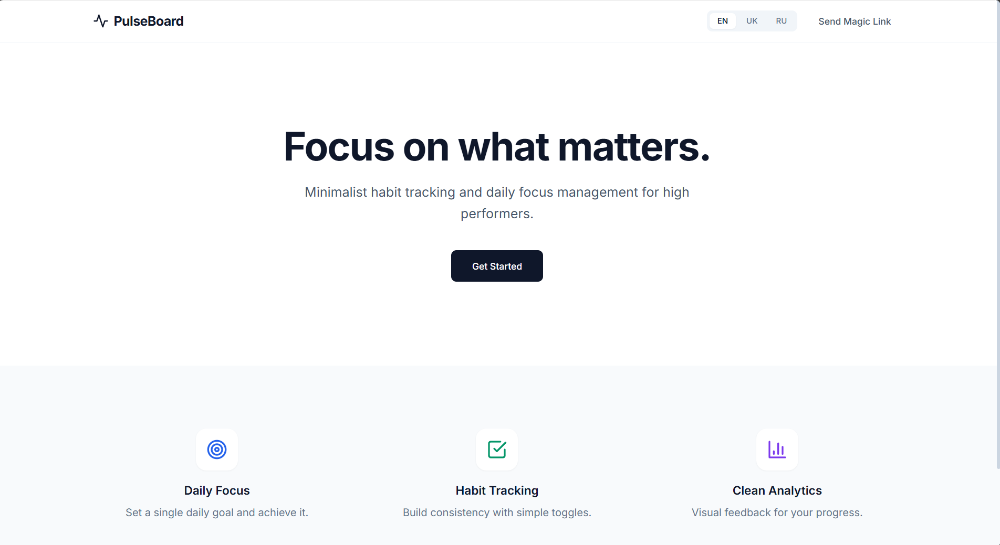
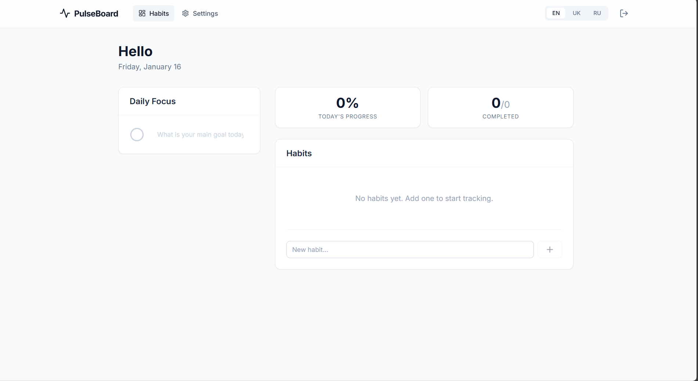
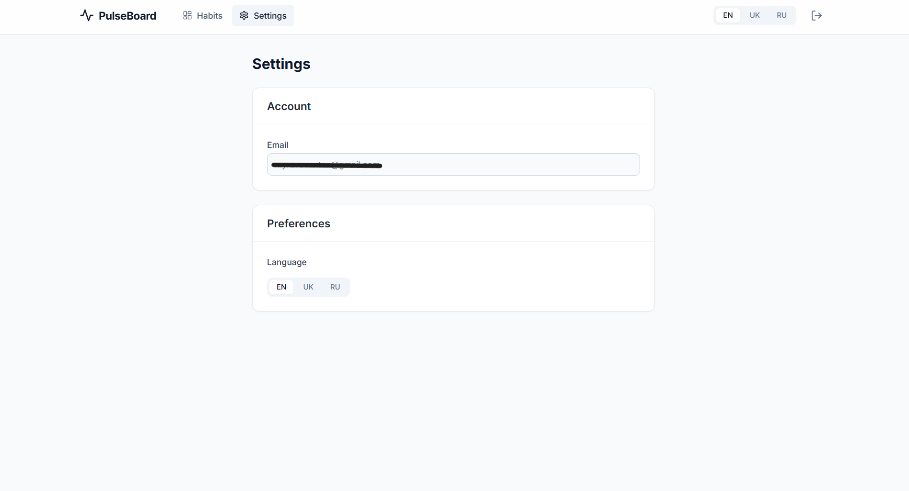
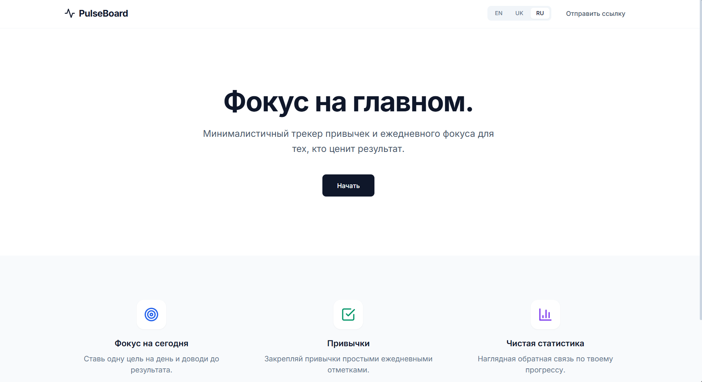
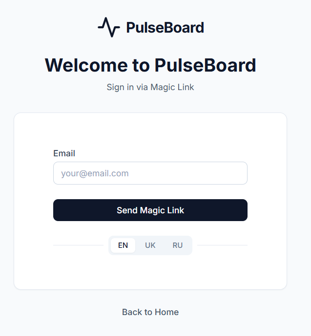

# PulseBoard

> A clean, modern habit tracker and daily focus planner with real authentication, multi-language support, and production-ready deployment.

[](https://pulseboard-lake.vercel.app/)
[](LICENSE)
[](README.md)

---

## 🎯 Overview

PulseBoard is a minimal habit tracking application designed to help users manage their daily habits and maintain focus on important tasks. Built as a portfolio project, it demonstrates modern web development practices including secure authentication, internationalization, and deployment best practices.

---

## ✨ Key Features

- **Protected Authentication**: Magic Link sign-in via Supabase
- **Landing & Dashboard**: Public landing page with protected application routes
- **Habit Management**: Full CRUD operations for habits and daily focus tracking
- **Multi-Language Support**: English, Russian, Ukrainian with fallback and interpolation
- **Settings Management**: User preferences and language switching
- **Production-Ready**: Optimized builds with Vite and TypeScript
- **Responsive Design**: Tailwind CSS for modern UI across all devices

---

## 🛠 Tech Stack

| Layer | Technology |
|-------|-----------|
| **Frontend** | React 18, TypeScript, Vite, Tailwind CSS |
| **Backend** | Supabase (PostgreSQL + Auth) |
| **Deployment** | Vercel |
| **Internationalization** | Custom i18n solution with EN/RU/UK support |

---

## 📸 Screenshots

| Landing Page | Dashboard | Settings |
|---|---|---|
|  |  |  |

| Russian Version | Login | Daily Focus |
|---|---|---|
|  |  |  |

---

## 🚀 Getting Started

### Prerequisites

- Node.js 16+
- npm or yarn
- Supabase account (free tier available)

### Installation

1. **Clone and install dependencies**
   ```bash
   npm install
   ```

2. **Configure environment variables**

   Create `.env.local` in the project root:
   ```env
   VITE_SUPABASE_URL=https://your-project.supabase.co
   VITE_SUPABASE_ANON_KEY=your_anon_key_here
   ```

3. **Start development server**
   ```bash
   npm run dev
   ```

   The app will be available at `http://localhost:5173`

### Supabase Setup

Configure authentication redirect URLs in **Supabase Dashboard** → **Authentication** → **URL Configuration**:

```
http://localhost:5173/app          # Local development
https://pulseboard-lake.vercel.app  # Production
```

### Build for Production

```bash
npm run build    # Create optimized build
npm run preview  # Test production build locally
```

---

## 📁 Project Structure

```
src/
├── app/              # Main app components with providers
├── pages/            # Page components (Dashboard, Settings, etc.)
├── components/
│   ├── dashboard/    # Dashboard-specific components
│   ├── layout/       # App shell and navigation
│   └── ui/           # Reusable UI components
├── i18n/             # Internationalization setup
├── lib/              # Utilities and Supabase client
├── routes/           # Protected route wrapper
└── styles/           # Global styles
```

---

## 🔐 Authentication Flow

PulseBoard uses Supabase Magic Link authentication:

1. User enters email on login page
2. Supabase sends magic link to email
3. User clicks link and is authenticated
4. Protected routes become accessible
5. Session persists via Supabase Auth

---

## 🌍 Internationalization

Supported languages with full UI translation:
- 🇬🇧 **English** (en)
- 🇷🇺 **Русский** (ru)
- 🇺🇦 **Українська** (uk)

Language preference is saved in user settings.

---

## 📊 Project Status

- ✅ MVP Complete
- ✅ Production Deployment Ready
- ✅ Portfolio Showcase Ready
- 🔄 In Active Development

### Planned Enhancements
- [ ] Analytics dashboard
- [ ] Export habit data
- [ ] Dark mode support
- [ ] Mobile app (React Native)
- [ ] Habit streaks visualization

---

## 📝 Available Scripts

| Command | Description |
|---------|-------------|
| `npm run dev` | Start development server with hot reload |
| `npm run build` | Create production build |
| `npm run preview` | Preview production build locally |
| `npm run lint` | Run ESLint checks |

---

## 🤝 Contributing

Contributions are welcome! This project is open for improvements and suggestions.

---

## 📄 License

This project is open source and available under the MIT License.

---

## 📧 Contact & Links

- **Live Demo**: [pulseboard-lake.vercel.app](https://pulseboard-lake.vercel.app/)
- **Portfolio**: Your portfolio link here

---

**Made with ❤️ as a portfolio project**